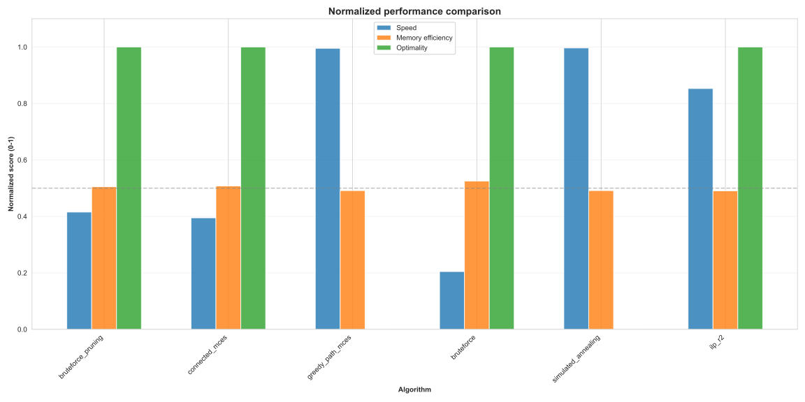
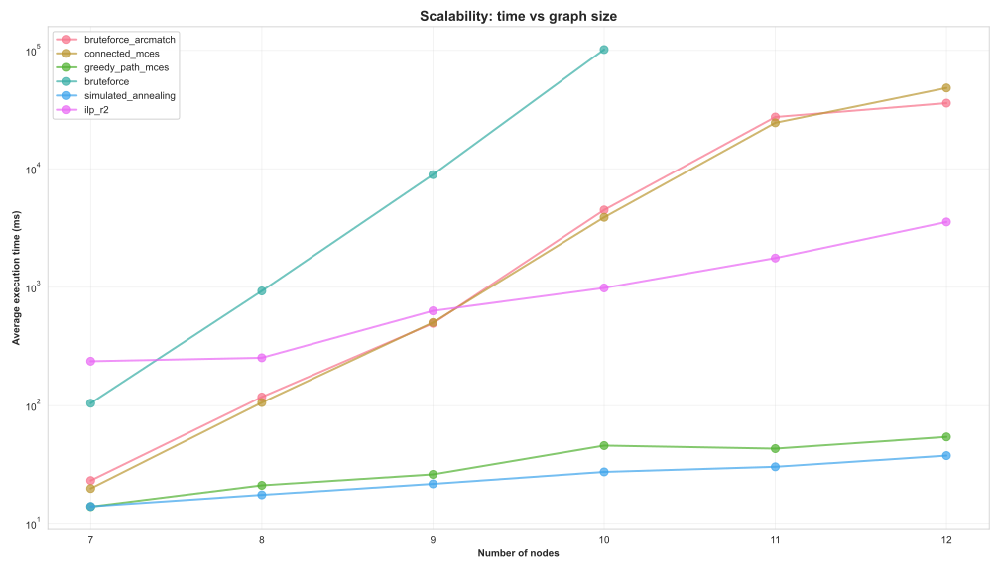
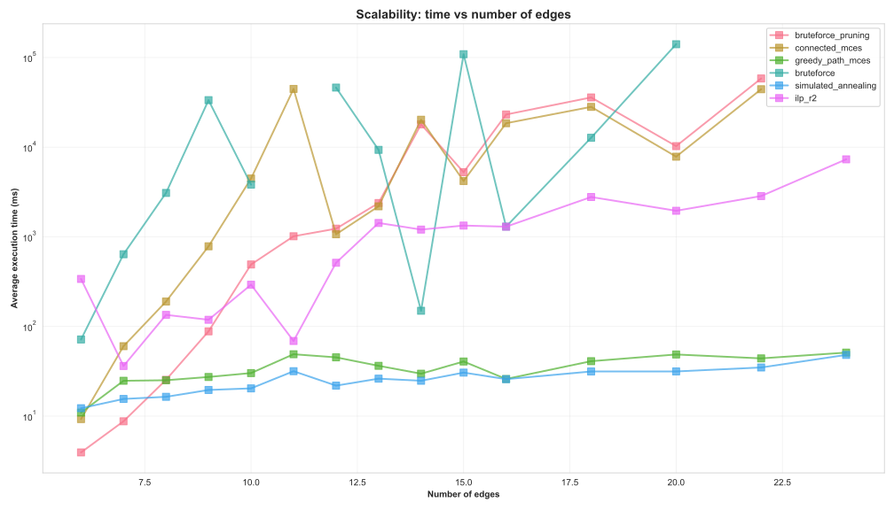
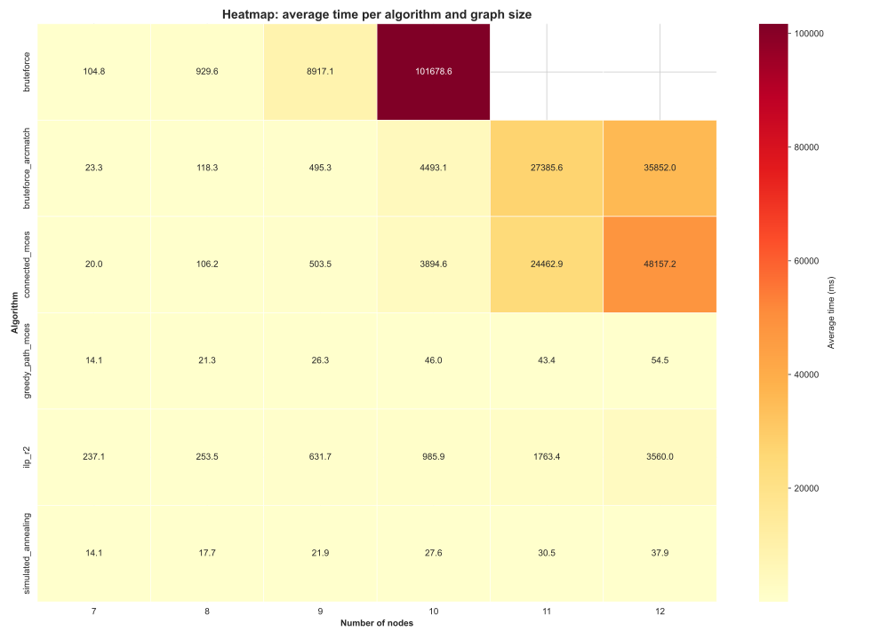
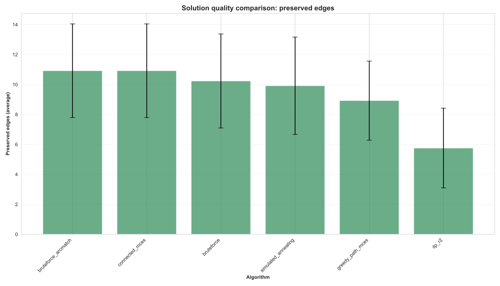
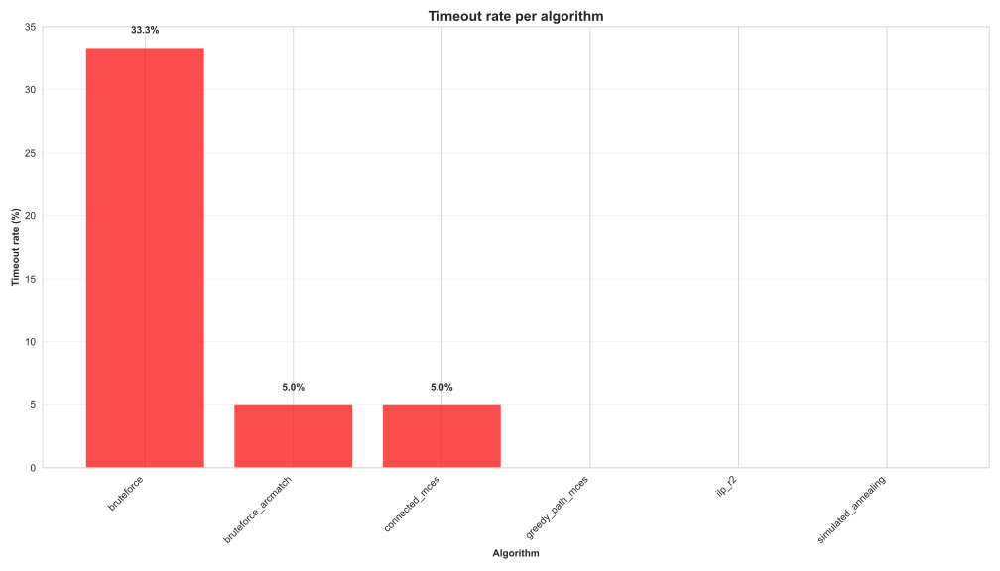

# Benchmark MCES Algorithms
## Maximum Common Edge Subgraph Problem

**Realizzato da Merenda Saverio Mattia**

---

# Il Problema MCES

## Definizione
Dati due grafi $G$ e $G'$, il problema MCES consiste nel trovare un grafo $H$ con il **massimo numero di archi** che sia isomorfo sia a un sottografo di $G$ che a un sottografo di $G'$.

## Complessità
- **NP-completo** per grafi generali
- **APX-hard**: difficile da approssimare
- Generalizza problemi noti: maximum clique, subgraph isomorphism

## Variante Connessa (MCCES)
Richiede che il sottografo comune sia **connesso** - la formulazione più usata nelle applicazioni pratiche.

---

# Applicazioni del MCES

## Chimica e Biologia Molecolare
- **Confronto di strutture molecolari**: Misura di similarità tra composti chimici
- **~94% dei composti NCI**: Hanno strutture outerplanar, rilevanti per MCES
- **Confronto proteine**: Identificare similarità strutturali

## Biologia Computazionale
- **Network alignment**: Mappare reti biologiche tra specie diverse
- **Protein-protein interaction networks**: Trovare pattern conservati
- **Studio malattie umane**: Transfer knowledge tra modelli biologici

## Altre Applicazioni
- **Pattern recognition**: Riconoscimento oggetti in image analysis
- **Social network analysis**: Analisi privacy utenti
- **Parallel programming**: Ottimizzazione sistemi distribuiti (Bokhari, 1981)

---

# 1. Purpose and Scope

## Obiettivo del Benchmark
Confrontare sistematicamente sei algoritmi per il problema MCES (Maximum Common Edge Subgraph) su grafi non orientati.

## Ambito
- **Problema**: Trovare il massimo sottografo comune tra due grafi
- **Dimensione grafi**: 7-12 nodi
- **Moltiplicatori archi**: 1.2×, 1.5×, 2× rispetto al numero di nodi
- **Ripetizioni**: 5 per ogni configurazione (n, m)
- **Timeout**: 300 secondi per algoritmo

---

# 2. Relevant Methods - Overview

## Sei Algoritmi Implementati

1. **Brute Force** - Enumerazione completa
2. **Brute Force with Pruning + Backtracking** - Con potatura
3. **Connected MCES** - Sottografi connessi
4. **Greedy Path** - Euristico basato su cammini
5. **ILP R2** - Programmazione lineare intera
6. **Simulated Annealing** - Metaeuristica

---

# 2.1. Brute Force Algorithm

Enumerazione completa di tutte le permutazioni possibili

```
INPUT: Due grafi G1 = (V1, E1) e G2 = (V2, E2)
OUTPUT: Mapping ottimale e archi preservati

1. best_mapping ← ∅
2. best_preserved ← ∅
3. FOR EACH permutazione p di V2 con lunghezza |V1| DO
4.    mapping ← zip(V1, p)
5.    preserved ← ∅
6.    FOR EACH arco (u,v) ∈ E1 DO
7.       IF (mapping[u], mapping[v]) ∈ E2 THEN
8.          preserved ← preserved ∪ {(u,v)}
9.    IF |preserved| > |best_preserved| THEN
10.      best_mapping ← mapping
11.      best_preserved ← preserved
12. RETURN (best_mapping, best_preserved)
```

**Complessità**: $O(|V_2|! \cdot |E_1|)$ - ottimale ma esponenziale

---

# 2.2. Brute Force with Pruning + Backtracking Algorithm

Backtracking con potatura basata su:
- Consistenza degli endpoint
- Limite superiore ottimistico

```
INPUT: Due grafi G1, G2
OUTPUT: Mapping ottimale e archi preservati

1. FUNCTION Backtrack(index, current_mapping, used_targets):
2.    IF index = |V1| THEN
3.       preserved ← CountPreservedEdges(current_mapping)
4.       IF |preserved| > |best_preserved| THEN
5.          best_mapping ← current_mapping
6.    FOR EACH target ∈ V2 WHERE target ∉ used_targets DO
7.       current_mapping[V1[index]] ← target
8.       IF CanPotentiallyImprove(current_mapping) THEN
9.          Backtrack(index+1, current_mapping, used_targets ∪ {target})
10.      ELSE
11.         pruned_branches ← pruned_branches + 1
12. CALL Backtrack(0, ∅, ∅)
```

**Miglioramento**: Potatura early che riduce lo spazio di ricerca

---

# 2.3. Connected MCES Algorithm

Backtracking che garantisce che gli archi preservati formino un sottografo **connesso** in G1

```
INPUT: Due grafi G1, G2
OUTPUT: Mapping che preserva sottografo connesso

1. FUNCTION IsPreservedConnected(preserved_edges):
2.    Costruisci grafo adiacenza da preserved_edges
3.    Esegui BFS/DFS dal primo nodo
4.    RETURN TRUE se tutti i nodi sono raggiungibili
5.
6. FUNCTION Backtrack(index, current_mapping):
7.    IF index = |V1| THEN
8.       preserved ← CountPreservedEdges(current_mapping)
9.       IF IsPreservedConnected(preserved) AND |preserved| > |best| THEN
10.         best_mapping ← current_mapping
11.   FOR EACH target ∈ V2 WHERE target non usato DO
12.      current_mapping[V1[index]] ← target
13.      IF CanImprove(current_mapping) THEN
14.         Backtrack(index+1, current_mapping)
```

**Vincolo aggiuntivo**: Connettività del sottografo risultante

---

# 2.4. Greedy Path MCES Algorithm

Euristico greedy che mappa iterativamente cammini brevi da G1 a G2 massimizzando gli archi preservati

```
INPUT: G1, G2, lunghezza massima cammino
OUTPUT: Mapping approssimato

1. mapping ← ∅
2. available_targets ← V2
3. WHILE esistono nodi non mappati in V1 DO
4.    best_gain ← 0
5.    FOR EACH nodo u ∈ V1 non mappato DO
6.       paths ← EnumeratePaths(u, max_path_len)
7.       FOR EACH path ∈ paths DO
8.          path_nodes ← nodi non mappati in path
9.          FOR EACH permutazione di available_targets DO
10.            gain ← CountNewPreservedEdges(permutazione)
11.            IF gain > best_gain THEN
12.               best_extension ← permutazione
13.   IF best_gain = 0 THEN BREAK
14.   Applica best_extension a mapping
15. RETURN mapping
```

**Caratteristica**: Non ottimale ma efficiente per grafi grandi

---

# 2.5. ILP R2 Algorithm

Formulazione come problema di Programmazione Lineare Intera (ILP)

```
INPUT: G1 = (V1, E1), G2 = (V2, E2)
OUTPUT: Mapping ottimale

1. Variabili binarie:
   x[u,v] = 1 se u ∈ V1 mappato a v ∈ V2
   z[u,v] = 1 se arco preservato

2. Funzione obiettivo:
   MAXIMIZE Σ z[u,v] per ogni u ∈ V1, v ∈ V2

3. Vincoli:
   - Ogni nodo u ∈ V1 mappa a max 1 nodo: Σ_v x[u,v] ≤ 1
   - Ogni nodo v ∈ V2 riceve max 1 nodo: Σ_u x[u,v] ≤ 1
   - Consistenza topologica:
     z[u,v] ≤ Σ x[neighbor(u), v] per ogni vicino
     z[u,v] ≤ Σ x[u, neighbor(v)] per ogni vicino

4. Risolvi ILP con solver (PuLP/CPLEX)
5. Estrai mapping e archi preservati dalla soluzione
```

**Vantaggio**: Ottimalità garantita (se converge)

---

# 2.6. Simulated Annealing Algorithm

Metaeuristica che accetta occasionalmente soluzioni peggiori per evitare minimi locali

```
INPUT: G1, G2, temperatura iniziale T, cooling_rate α
OUTPUT: Mapping approssimato

1. current ← RandomAlignment(G1, G2)
2. best ← current
3. temperature ← T
4. WHILE temperature > 0.001 DO
5.    candidate ← Perturb(current)
6.    candidate ← GreedyLocalSearch(candidate)
7.    Δ ← Score(candidate) - Score(current)
8.    IF Δ ≥ 0 OR random() < exp(Δ/temperature) THEN
9.       current ← candidate
10.      IF Score(current) > Score(best) THEN
11.         best ← current
12.   temperature ← temperature × α
13. RETURN best

FUNCTION Perturb(alignment):
   Scambia casualmente 2 mappature
```

**Caratteristica**: Probabilità di accettazione decresce con temperatura

---

# 3. Representative Datasets

## Generazione Sintetica
- **Generatore**: Grafi casuali con parametri controllati
- **Range nodi**: 7-12 (per evitare esplosione combinatoria)
- **Strategia archi**: Moltiplicatori 1.2×, 1.5×, 2× del numero di nodi
- **Ripetizioni**: 5 istanze per configurazione (n, m)

## Caratteristiche Dataset
- Grafi **non orientati**
- Nessun self-loop
- Connessione minima garantita (ogni nodo ha almeno 1 arco)
- **Seed casuale**: 9871 per riproducibilità

## Copertura Spazio
Total runs: $\sum_{n=7}^{12} |\text{edge\_counts}(n)| \times 5 \times 6 \approx 540$ esecuzioni

---

# 4. Parameter Values & Software

<div class="columns">
<div>

## Parametri Benchmark
| Parametro | Valore |
|-----------|--------|
| N_MIN | 7 |
| N_MAX | 12 |
| REPEATS | 5 |
| EDGE_MULTIPLIERS | [1.2, 1.5, 2.0] |
| PER_CALL_TIMEOUT | 300s |
| MAX_WORKERS | 5 |
| RANDOM_SEED | 9871 |

</div>
<div>

## Software Stack
- **Python**: 3.11+
- **Librerie**: NetworkX, PuLP, psutil
- **Backend**: Flask API
- **Environment**: Processo separato per timeout
- **Parallelizzazione**: ThreadPoolExecutor + multiprocessing

</div>
</div>

---

# 5. Quantitative Performance Metrics

## Metriche Primarie
1. **Preserved Edges Count**: Numero archi preservati (qualità soluzione)
2. **Runtime (wall time)**: Tempo reale esecuzione (sec)
3. **Timeout Status**: Se algoritmo ha terminato entro 300s

## Metriche Secondarie
- **mappings_explored**: Numero mappature esplorate
- **recursive_calls**: Chiamate ricorsive (backtracking)
- **pruned_branches**: Rami potati (ottimizzazione)
- **memory_usage_mb**: Memoria RAM utilizzata
- **solution_optimality**: Garanzia di ottimalità (bool)

---

# 6. Secondary Measures

## Requisiti Computazionali
- **Timeout handling**: Processo separato con terminazione forzata
- **Parallelizzazione**: ThreadPoolExecutor per esecuzioni concorrenti
- **File locking**: Scrittura thread-safe su CSV

## User-Friendliness
- **Configurazione**: Parametri in cima a `benchmark.py`
- **Output**: CSV incrementale con metadati JSON
- **Logging**: Progress real-time `[idx/total]`

## Documentazione
- README.md completo
- Docstring per ogni algoritmo
- Schema dati consistente (mapping, preserved_edges, stats)

---

# Results: Performance Summary



---

# Results: Time vs Graph Size



---

# Results: Time vs Edges



---

# Results: Heatmap Time by Size



---

# Results: Solution Quality



---

# Results: Search Space Exploration


---

# Results: Timeout Analysis



---

# 7. Results Interpretation

## Prospettiva Utente
**Quando usare ciascun algoritmo?**
- **Brute Force / Pruning+Backtrack**: Grafi piccoli (≤8 nodi), ottimalità garantita
- **ILP R2**: Grafi medi (≤12 nodi), se solver disponibile
- **Connected MCES**: Se necessario sottografo connesso
- **Greedy Path**: Approssimazione veloce, grafi più grandi
- **Simulated Annealing**: Quando tempo limitato, soluzione sub-ottimale accettabile

## Prospettiva Sviluppatore
- **Trade-off**: Ottimalità vs tempo di esecuzione
- **Pruning efficace**: riduce drasticamente spazio ricerca
- **Metaeuristiche**: SA e Greedy non garantiscono ottimalità ma scalano meglio
- **ILP**: Dipende da qualità solver, può essere competitivo

---

# 8. Accessible Format

## Formato Output
- **CSV**: `benchmark_results.csv` con una riga per run
- **Metadati JSON**: Parametri benchmark salvati
- **Timestamp**: Cartella per ogni esecuzione (`YYYYMMDD-HHMMSS`)

## Accessibilità
- Formato standard (CSV)
- Header descrittivo
- Valori mancanti gestiti (timeout → campi vuoti)

---

# 9. Future Extensions

## Design Estensibile
- **Nuovi algoritmi**: Basta aggiungere funzione alla lista `algorithms`
- **Nuove metriche**: Estendere dizionario `stats`
- **Range parametri**: Variabili configurabili in cima al file

## Possibili Estensioni
1. **Grafi più grandi**: Aumentare N_MAX (richiede algoritmi scalabili)
2. **Grafi orientati**: Modificare generatore e algoritmi
3. **Grafi pesati**: Aggiungere peso archi
4. **Benchmark parallelo GPU**: Per algoritmi parallelizzabili
5. **Analisi statistica automatica**: Script plot.py integrato
6. **Confronto con baseline pubblici**: Dataset standard (MCS benchmark)

---

# 10. Reproducible Research

## Best Practices Implementate

### Codice Pubblico
- **Repository GitHub**: `https://github.com/merendamattia/mces`
- **Conventional Commits**: Git hooks per messaggi standardizzati

### Riproducibilità
- **Seed fissato**: `RANDOM_SEED = 9871`
- **Versioni software**: `requirements.txt` con dipendenze
- **Docker**: `Dockerfile` e `docker-compose.yaml`

### Tracciabilità
- **Git tags**: Release versionata
- **Timestamp**: Ogni run salvato in cartella datata
- **CSV incrementale**: Risultati non sovrascritti

---

# Grazie per l'attenzione!

## Domande?

**Repository**: https://github.com/merendamattia/mces
**Documentazione**: README.md
**Licenza**: Apache 2.0
